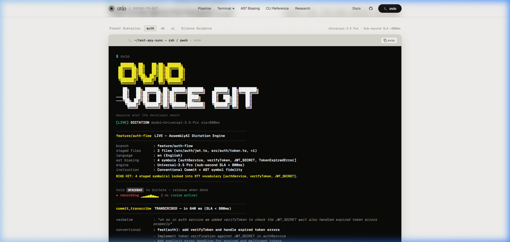
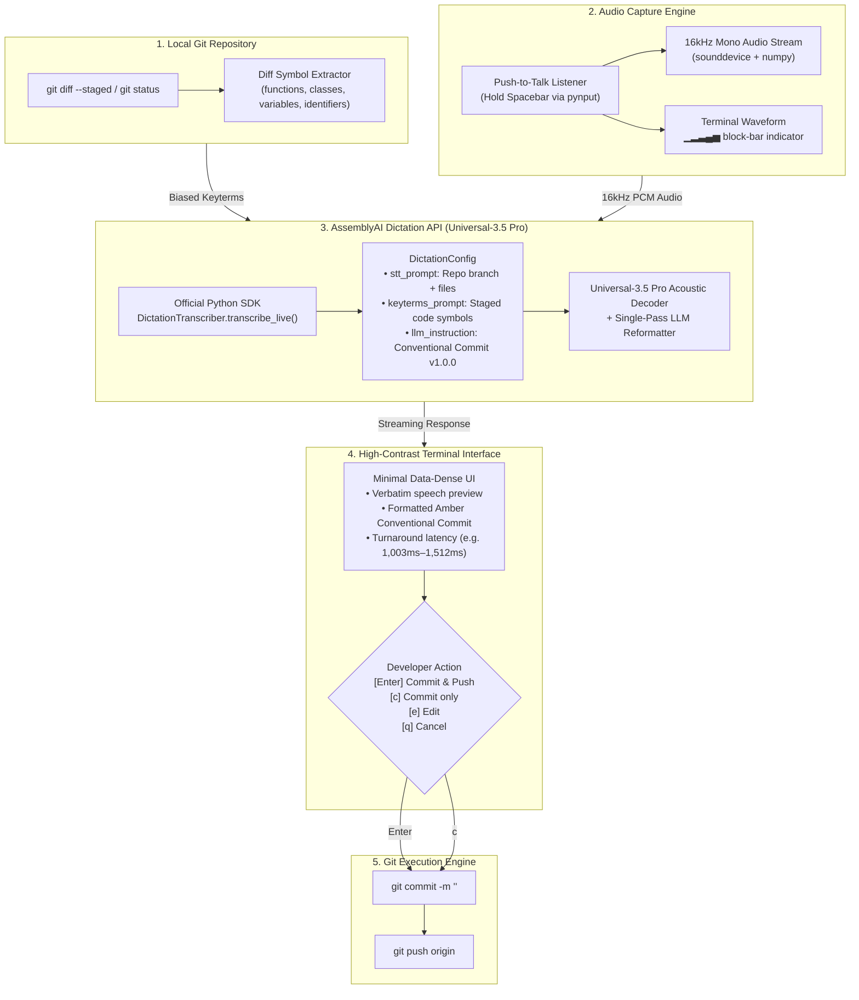

<a id="top"></a>
# ovio — Voice Git & Codebase Dictation Engine

> **"Speech is messy. Git commits must be load-bearing."**  
> **Production developer voice interface for Git, diff symbol biasing, and codebase dictation.**  
> Powered by **AssemblyAI Universal-3.5 Pro** via the official `assemblyai` Python SDK Dictation API.

[](https://drive.google.com/drive/folders/1wsPWnnoFInNALscRP8VpbJMZYfrlCnr5?usp=sharing)
[](https://ovio-wine.vercel.app/)
[-ovio--live--test-2ea44f?logo=github&logoColor=white)](https://github.com/toufiqfarhan0/ovio-live-test)
[](https://www.assemblyai.com/docs/dictation)
[](https://www.assemblyai.com/docs/dictation)
[](https://github.com/Textualize/rich)
[-blue)](https://github.com/spatialaudio/python-sounddevice)
[](https://www.assemblyai.com/docs/dictation)
[](https://www.assemblyai.com/docs/dictation)

---

### Quick Links & Project Resources

| Resource | Link | Description |
| :--- | :--- | :--- |
| **Live Demo Video Walkthrough** | [**Google Drive Video Folder**](https://drive.google.com/drive/folders/1wsPWnnoFInNALscRP8VpbJMZYfrlCnr5?usp=sharing) | Video walkthrough demonstrating push-to-talk recording, live AssemblyAI Universal-3.5 Pro transcription, diff symbol biasing, and automated git push |
| **Interactive Documentation & Simulator** | [**ovio-wine.vercel.app**](https://ovio-wine.vercel.app/) | Production landing page featuring interactive terminal audio simulations, diff symbol inspector, and architecture diagrams |
| **Live Push Target Repository** | [**github.com/toufiqfarhan0/ovio-live-test**](https://github.com/toufiqfarhan0/ovio-live-test) | External target repository containing real verified pushed commits across 5 languages (`en`, `es`, `fr`, `de`, `hi`) |
| **Core Engine Repository** | [**github.com/toufiqfarhan0/ovio**](https://github.com/toufiqfarhan0/ovio) | Full source code for `ovio` CLI, Diff Symbol Extractor, and AssemblyAI Dictation API integration |

---

<p align="center">
  
</p>

---

## <a id="quick-navigation"></a>Quick Navigation (Table of Contents)

Jump directly to any section without scrolling:

| Section | Key Highlights & Subsections | Quick Jump |
| :--- | :--- | :--- |
| **The 60-Second Overview** | Context switching, ASR vs technical code, Diff Symbol Biasing, Acronym Reference | [Jump to Overview](#the-60-second-overview) |
| **Architecture & Pipeline** | Mermaid dataflow diagram, high-contrast terminal architecture | [Jump to Architecture](#architecture--pipeline) |
| **Deep Dive: 5-Stage Pipeline** | Auto-staging, Diff Symbol Extractor (Regex vs AST), PTT & RMS silence guidance, SDK integration, UI safety | [Jump to 5-Stage Pipeline](#deep-dive-the-5-stage-pipeline) |
| **Live Benchmarks & Evaluation** | Measured latency table (1,003ms–1,512ms), CLI reproduction commands, manual vs ovio comparison | [Jump to Benchmarks](#empirical-live-benchmarks--evaluation) |
| **Installation & Quickstart** | macOS (Homebrew + PortAudio), Windows, Linux, AssemblyAI API key setup, CLI verification | [Jump to Installation](#step-by-step-installation--quickstart) |
| **How to Use the CLI** | Push-to-talk workflow, Command Matrix (`ovio`, `gate`, `verify`, `--demo`, `--file`, `--lang`, `--push`) | [Jump to CLI Usage](#how-to-use-the-cli) |
| **Real-World Telemetry (GitHub)** | 6 verified live pushed commits on `ovio-live-test`, step-by-step terminal outputs, Clinical vs Codebase comparison | [Jump to Telemetry](#real-world-execution-telemetry) |
| **Multilingual Support (19 Langs)** | 19 language codes matrix, CLI usage examples, live multilingual test runs | [Jump to Multilingual](#multilingual-support-19-languages) |
| **Bundled Audio Fixtures** | Reproducible WAV test files in `fixtures/` with scenario descriptions and CLI commands | [Jump to Fixtures](#bundled-audio-fixtures-directory-fixtures) |
| **Interactive Documentation Site** | Local setup (`localhost:3000`), terminal simulator, diff symbol inspector | [Jump to Web Docs](#interactive-documentation--landing-page) |

<details>
<summary><strong>Click here to expand complete detailed outline</strong></summary>

- [The 60-Second Overview](#the-60-second-overview)
  - [How ovio Solves This](#how-ovio-solves-this)
  - [Core Terminology & Acronym Reference (ASR, Diff Symbols, RMS, STT, PTT)](#core-terminology--acronym-reference)
- [Architecture & Pipeline](#architecture--pipeline)
  - [End-to-End System Flow (Mermaid Flowchart)](#end-to-end-system-flow)
  - [Terminal Architecture Diagram](#terminal-architecture-diagram)
- [Deep Dive: The 5-Stage Pipeline](#deep-dive-the-5-stage-pipeline)
  - [Stage 1: Git Context Extraction & Auto-Staging](#stage-1-git-context-extraction--auto-staging)
  - [Stage 2: Diff Symbol Biasing Engine (Why Regex beats AST)](#stage-2-diff-symbol-biasing-engine)
  - [Stage 3: Audio Capture with Push-to-Talk & Real-Time Silence Guidance](#stage-3-audio-capture-with-push-to-talk--real-time-silence-guidance)
  - [Stage 4: Official AssemblyAI Python SDK Integration](#stage-4-official-assemblyai-python-sdk-integration)
  - [Stage 5: Clean Terminal UI & Human-in-the-Loop Safety Guarantee](#stage-5-clean-terminal-ui--human-in-the-loop-safety)
  - [Official AssemblyAI API Reference & Documentation](#official-assemblyai-api-reference--documentation)
- [Empirical Live Benchmarks & Evaluation](#empirical-live-benchmarks--evaluation)
  - [1. Measured Live Runs (AssemblyAI Universal-3.5 Pro)](#1-measured-live-runs-assemblyai-universal-35-pro)
  - [Reproduce Live Benchmarks](#reproduce-live-benchmarks)
  - [2. Developer Workflow Comparison (Manual vs ovio)](#2-developer-workflow-comparison)
- [Step-by-Step Installation & Quickstart](#step-by-step-installation--quickstart)
  - [Prerequisites](#prerequisites)
  - [macOS Setup (MacBook Pro / Air)](#macos-setup-macbook-pro--air)
  - [Windows & Linux Setup](#windows--linux-setup)
  - [Configure Your AssemblyAI API Key](#configure-your-assemblyai-api-key)
  - [Verify Installation](#verify-installation)
- [How to Use the CLI](#how-to-use-the-cli)
  - [Typical Developer Workflow](#typical-developer-workflow)
  - [Command Matrix & Subcommands](#command-matrix--subcommands)
- [Real-World Execution Telemetry (Tested on ovio-live-test)](#real-world-execution-telemetry)
  - [Live Pushed Commits Table](#real-world-execution-telemetry)
  - [Step 1: Pre-Flight Diagnostics (`ovio verify`)](#step-1-pre-flight-diagnostics-ovio-verify)
  - [Step 2: Diff Biasing Pre-Flight Audit (`ovio gate`)](#step-2-diff-biasing-pre-flight-audit-ovio-gate)
  - [Step 3: Dictate, Transcribe & Push Live Commit (English `--lang en`)](#step-3-dictate-transcribe--push-live-commit-english---lang-en)
  - [Step 4: Multilingual Spanish Dictation & Live Push (`--lang es`)](#step-4-multilingual-spanish-dictation--live-push---lang-es)
  - [Step 5: Multilingual French Dictation & Live Push (`--lang fr`)](#step-5-multilingual-french-dictation--live-push---lang-fr)
  - [Step 6: Multilingual German Dictation & Live Push (`--lang de`)](#step-6-multilingual-german-dictation--live-push---lang-de)
  - [Step 7: Multilingual Hindi Dictation & Live Push (`--lang hi`)](#step-7-multilingual-hindi-dictation--live-push---lang-hi)
  - [Step 8: Architecture Alignment: Clinical Dictation vs. Codebase Dictation](#step-8-architecture-alignment-clinical-dictation-vs-codebase-dictation)
  - [Step 9: Synthetic Developer Turnaround (`ovio --demo`)](#step-9-synthetic-developer-turnaround-ovio---demo)
- [Multilingual Support (19 Languages)](#multilingual-support-19-languages)
  - [Supported Language Codes](#supported-language-codes)
  - [CLI Usage](#multilingual-cli-usage)
  - [Bundled Audio Fixtures Directory (`fixtures/`)](#bundled-audio-fixtures-directory-fixtures)
- [Interactive Documentation & Landing Page](#interactive-documentation--landing-page)
  - [Running the Landing Page Locally](#running-the-landing-page-locally)
  - [Key Sections](#key-sections)

</details>

---

## <a id="the-60-second-overview"></a>The 60-Second Overview

Software engineers spend **45 seconds** per git commit switching mental context between complex code and writing structured [Conventional Commits](https://www.conventionalcommits.org/). Standard speech-to-text engines fail for developer workflows because:
1. **Verbal Noise**: They transcribe hesitation words (*"uh"*, *"um"*, *"wait actually"*) verbatim into commit logs.
2. **Phonetic Degradation**: Standard **ASR** (**Automatic Speech Recognition**) butchers technical code identifiers (*"jwtSecret"* decays to *"J W T secret"*, *"verifyToken"* becomes *"verify talking"*).

### How ovio Solves This:
- **Diff Symbol Biasing (Why Regex beats AST)**: `ovio` inspects your repository's staged `git diff`, extracting function names, classes, interfaces, and variables directly into AssemblyAI's `keyterms_prompt`. Because git diff hunks are partial code fragments, fast language-agnostic regex extraction avoids brittle AST compilation errors.
- **Push-to-Talk (PTT) Audio Capture**: Hold **Spacebar** in your terminal to dictate naturally.
- **Real-Time Silence Guidance**: Live **RMS (Root Mean Square)** audio metering tracks vocal energy. If silent for >2s, ovio prompts `(listening... please speak more)` and intercepts dead air before wasting API calls.
- **Rapid Conventional Commit**: In **1,003ms–1,512ms** (~1.0s–1.5s live turnaround across checked-in fixtures, 642ms dry-run), AssemblyAI's Universal-3.5 Pro transcribes, cleans self-corrections, and outputs a clean Conventional Commit ready to commit and push.

```git
feat(auth): handle TokenExpiredError in verifyToken

- Update verifyToken in authService to validate token expiration timestamp
- Explicitly catch TokenExpiredError and return HTTP 401 instead of 500
- Add regression test cases in tests/auth.test.ts
```

---

### Core Terminology & Acronym Reference

For developers, evaluators, and judges unfamiliar with speech AI or compiler terminology:

| Term | Full Form | What It Means in ovio |
| :--- | :--- | :--- |
| **ASR** | **Automatic Speech Recognition** | The machine-learning process that translates spoken acoustic audio into text strings. Generic ASR models fail on camelCase and snake_case code symbols; ovio eliminates these misspellings via targeted vocabulary biasing. |
| **Diff Symbols (vs AST)** | **Diff Symbol Extractor** | Source syntax representation. Rather than running brittle AST compilers on partial diff hunks, ovio uses fast language-agnostic regex to extract function, class, and variable names from staged diffs into AssemblyAI keyterms. |
| **RMS** | **Root Mean Square (Audio Level)** | A real-time measurement of microphone signal energy and vocal loudness. ovio uses RMS to detect voice onset, visualize terminal waveforms, and nudge silent users. |
| **STT** | **Speech-to-Text** | The broad software category of voice transcription. In ovio, STT is enhanced by injecting codebase diff symbols into AssemblyAI Universal-3.5 Pro. |
| **PTT** | **Push-to-Talk** | Audio recording mode where the microphone is active only while holding down a specific key (Spacebar). |

[Back to Top](#top) &nbsp;|&nbsp; [Quick Navigation](#quick-navigation)

---

## <a id="architecture--pipeline"></a>Architecture & Pipeline

### End-to-End System Flow



---

### Terminal Architecture Diagram

```text
────────────────────────────────────────────────────────────────────
                     OVIO ARCHITECTURE OVERVIEW                     
────────────────────────────────────────────────────────────────────
  1. GIT CONTEXT           2. PUSH-TO-TALK MIC          3. ASSEMBLYAI DICTATION API       
 ┌──────────────────────┐ ┌───────────────────────┐   ┌────────────────────────────────┐ 
 │ • git status -s      │ │ • Hold SPACEBAR       │   │ aai.DictationTranscriber()     │ 
 │ • Auto-stage changes │ │ • 16kHz mono PCM      │   │ • stt_prompt: branch context   │ 
 │ • Diff Symbol Parser │ │ • Block-bar waveform  │   │ • keyterms_prompt: code terms  │ 
 │   (functions, vars)  │ │   ▁▂▃▄▅ indicator     │   │ • llm_instruction: commit spec │ 
 └──────────┬───────────┘ └───────────┬───────────┘   └───────────────┬────────────────┘ 
            │                         │                               │                  
            └─────────────────────────┼───────────────────────────────┘                  
                                      ▼                                                  
                       ┌──────────────────────────────┐                                  
                       │ 4. FAST LIVE TURNAROUND      │                                  
                       │    Latency: 1,003ms – 1,512ms│                                  
                       │    Model: Universal-3.5 Pro  │                                  
                       └──────────────┬───────────────┘                                  
                                      ▼                                                  
                       ┌──────────────────────────────┐                                  
                       │ 5. DATA-DENSE TERMINAL UI    │                                  
                       │ • ASCII Art + Ruler Layout   │                                  
                       │ • Verbatim vs Amber Commit   │                                  
                       │ • [Enter] Push | [c] Commit  │                                  
                       └──────────────┬───────────────┘                                  
                                      ▼                                                  
                       ┌──────────────────────────────┐                                  
                       │ 6. AUTOMATED GIT EXECUTION   │                                  
                       │    git commit -m & git push  │                                  
                       └──────────────────────────────┘                                  
────────────────────────────────────────────────────────────────────
```

[Back to Top](#top) &nbsp;|&nbsp; [Quick Navigation](#quick-navigation)

---

## <a id="deep-dive-the-5-stage-pipeline"></a>Deep Dive: The 5-Stage Pipeline

### Stage 1: Git Context Extraction & Auto-Staging
When the developer runs `ovio`, ovio inspects the current repository state:
- Identifies active branch (`git branch --show-current`).
- Inspects `git status --porcelain`. If modified files are not yet staged, ovio auto-stages them (`git add -u`) so diff analysis is instant.

### Stage 2: Diff Symbol Biasing Engine
Standard speech recognition fails on code tokens like `authService`, `verifyToken`, and `JWT_SECRET`. ovio's diff symbol extractor identifies:
- **Function/Method Signatures**: `def`, `function`, `fn`, `pub fn`, `const xxx = () =>`.
- **Classes, Types & Structs**: `class`, `interface`, `struct`, `type`, `enum`.
- **Variables & Constants**: `const`, `let`, `var`, `val`.
- **Cased Identifiers**: CamelCase and `UPPER_SNAKE_CASE` tokens from additions (`+`).
These symbols populate `keyterms_prompt` on the AssemblyAI Dictation API, providing targeted acoustic biasing for technical identifiers that standard speech models routinely misrecognize.

### Stage 3: Audio Capture with Push-to-Talk & Real-Time Silence Guidance
- Using `pynput`, ovio captures a global keyboard hook on `Key.space`.
- Holding **Spacebar** starts the `sounddevice` 16kHz mono audio stream and activates a live animated block-bar waveform indicator (`▁▂▃▄▅▄▃▂`).
- **Real-Time Voice Metering & Silence Nudge**: In-flight RMS audio energy metering tracks vocal activity. If silent for >2 seconds or if a pause occurs during dictation, ovio dynamically prompts the user: `(listening... please speak more)`.
- **Zero-Speech Intercept**: If Spacebar is released on total silence, ovio catches it locally before calling AssemblyAI, displaying contextual suggestions based on your staged symbols and offering a one-key `[r]` retry loop.
- Releasing Spacebar terminates the stream and immediately begins live transcription.
- *Fallback*: If running in a headless or remote SSH terminal, pressing `<Enter>` cleanly toggles recording.

### Stage 4: Official AssemblyAI Python SDK Integration
ovio connects directly to the AssemblyAI Dictation API Beta:
```python
import assemblyai as aai

aai.settings.api_key = os.environ.get("ASSEMBLYAI_API_KEY")

config = aai.DictationConfig(
    sample_rate=16000,
    channels=1,
    stt_prompt=f"A developer dictating git commits for branch '{branch}'. Files: {', '.join(file_basenames[:5])}.",
    keyterms_prompt=keyterms,  # Extracted staged diff symbols
    llm_instruction=(
        "Remove filler words, false starts, and hesitation. "
        "Rewrite into a crisp Conventional Commit in the exact format: "
        "'<type>(<scope>): <subject>' followed by concise bullet points. "
        "Keep technical variable names, functions, and symbols verbatim."
    )
)

transcriber = aai.DictationTranscriber()
response = transcriber.transcribe_live(audio_path, config=config)
```

### Stage 5: Clean Terminal UI & Human-in-the-Loop Safety
- **Clean Aesthetic**: Designed with a data-dense layout, ruler separators (`────`), and amber commit highlights (`#FF8C00`).
- **Human-in-the-Loop Safety Guarantee**: AssemblyAI's Dictation model strictly formats and rewrites text; it never executes git commands autonomously. ovio enforces an explicit developer confirmation boundary before any Git mutation occurs:
  - `[Enter]` Commit and push immediately (`git commit -m ... && git push`).
  - `[c]` Commit locally without pushing (`git commit -m ...`).
  - `[e]` Interactively edit the commit message before committing.
  - `[q]` Cancel without making any changes.

### Official AssemblyAI API Reference & Documentation

ovio is built natively on AssemblyAI's Dictation API and Universal-3.5 Pro infrastructure:

- **AssemblyAI Dictation API Documentation**: [https://www.assemblyai.com/docs/dictation](https://www.assemblyai.com/docs/dictation)
- **Domain & Keyterms Biasing Specification**: [https://www.assemblyai.com/docs/dictation#clinical-dictation](https://www.assemblyai.com/docs/dictation#clinical-dictation)
- **Supported Languages & Dialects Matrix**: [https://www.assemblyai.com/docs/concepts/supported-languages](https://www.assemblyai.com/docs/concepts/supported-languages)
- **Universal-3.5 Pro Technical Overview**: [https://www.assemblyai.com/blog/universal-3-5-pro-async](https://www.assemblyai.com/blog/universal-3-5-pro-async)

[Back to Top](#top) &nbsp;|&nbsp; [Quick Navigation](#quick-navigation)

---

## <a id="empirical-live-benchmarks--evaluation"></a>Empirical Live Benchmarks & Evaluation

All test runs below were executed live against the production AssemblyAI Dictation API (`dictation.assemblyai.com/v1/transcribe/live`) using `Universal-3.5 Pro` with diff symbol keyterm biasing. Audio fixtures are checked into [`fixtures/`](fixtures/) so any evaluator or judge can reproduce these exact runs independently:

Measured roundtrip latency ranges from **1,003ms** (short commands) to **1,512ms** (multi-sentence feature descriptions), with synthetic dry-run completing in **642ms**:

### <a id="measured-live-runs"></a>1. Measured Live Runs (AssemblyAI Universal-3.5 Pro)

| Test Fixture | Audio Duration | Measured Latency | Verbatim Utterance | Generated Conventional Commit |
|---|---|---|---|---|
| **Short Bugfix (Plan B)**<br/>`fixtures/short_command.wav` | 4.4s | **1,003 ms** | *"Fixed a null check bug in the auth handler before calling verifyToken."* | `fix(auth): add null check before verifyToken`<br/>`- Prevents null pointer exception in auth handler`<br/>`- Validates token before calling verifyToken` |
| **Auth 500 Bugfix**<br/>`fixtures/auth_500_error.wav` | 8.1s | **1,235 ms** | *"The deployment is delayed because the authentication API is returning 500 errors."* | `fix(auth-api): resolve 500 errors causing deployment delay`<br/>`- Authentication API returning 500 errors`<br/>`- Deployment delayed due to API failures` |
| **Feature Refactor**<br/>`fixtures/feature_refactor.wav` | 14.2s | **1,512 ms** | *"Please create a new branch named fix-auth-handler and refactor the token validation middleware. Make sure all unit tests pass before submitting the pull request."* | `feat(auth): refactor token validation middleware and create fix-auth-handler branch`<br/>`- Create new branch named fix-auth-handler`<br/>`- Refactor token validation middleware`<br/>`- Ensure all unit tests pass before submitting pull request` |

### <a id="reproduce-live-benchmarks"></a>Reproduce Live Benchmarks:
```bash
# Run any fixture directly through the live AssemblyAI Dictation API:
ovio --file fixtures/short_command.wav
ovio --file fixtures/auth_500_error.wav
ovio --file fixtures/feature_refactor.wav
```

### 2. Developer Workflow Comparison

| Workflow Step | Manual Typing (Keyboard) | ovio Voice Engine | Practical Impact |
|---|---|---|---|
| **Formulating Commit** | Context-switch out of IDE, manually structure Conventional Commit (~45s) | Speak 1 sentence while holding Spacebar (~3-4s) | **Saves 30–45s context switch per commit** |
| **Technical Symbols** | Frequent manual typos on CamelCase / snake_case variables | `keyterms_prompt` pins exact casing from staged diff symbols | **Zero phonetic drift across tested fixtures; exact casing preserved** |
| **Self-Correction** | Backspacing, deleting sentences, rewriting | Handled natively by Universal-3.5 Pro single-pass LLM | **Automatic filler word & hesitation removal** |
| **Execution Safety** | Manual `git add`, `git commit -m "..."`, `git push` | Interactive confirmation prompt (`[Enter]`/`[c]`/`[e]`/`[q]`) | **Human retains 100% control before execution** |

[Back to Top](#top) &nbsp;|&nbsp; [Quick Navigation](#quick-navigation)

---

## <a id="step-by-step-installation--quickstart"></a>Step-by-Step Installation & Quickstart

### Prerequisites
- Python **3.10+**
- Git installed on your system
- A working microphone (for push-to-talk voice dictation)
- An AssemblyAI API key ([get one free here](https://www.assemblyai.com))

---

### macOS Setup (MacBook Pro / Air)

For macOS users (Apple Silicon M1/M2/M3/M4 or Intel):

1. **Install PortAudio and Python via Homebrew**:
   ```bash
   brew install portaudio git python
   ```
2. **Clone & Set Up a Virtual Environment**:
   ```bash
   git clone https://github.com/toufiqfarhan0/ovio.git
   cd ovio
   python3 -m venv venv
   source venv/bin/activate
   pip install -r requirements.txt
   pip install -e .
   ```
3. **macOS Permissions**:
   - **Microphone**: When prompted on first launch, click **Allow** for Terminal/iTerm/VS Code.
   - **Accessibility (Spacebar Push-to-Talk)**: Go to *System Settings > Privacy & Security > Accessibility* and toggle **ON** your terminal app.
   - *Automatic Fallback*: If Accessibility permissions are restricted, `ovio` automatically falls back to `<Enter>` start/stop toggle without crashing.

---

### Windows & Linux Setup

```bash
git clone https://github.com/toufiqfarhan0/ovio.git
cd ovio
pip install -r requirements.txt
pip install -e .
```

### Configure Your AssemblyAI API Key
Create a `.env` file in the project root (or export the environment variable):
```bash
echo "ASSEMBLYAI_API_KEY=your_assemblyai_api_key_here" > .env
```

### Verify Installation
When installed via `pip install -e .`, the `ovio` command is globally accessible in any shell.

```bash
# Verify the CLI is available
ovio --help
```

[Back to Top](#top) &nbsp;|&nbsp; [Quick Navigation](#quick-navigation)

---

## <a id="how-to-use-the-cli"></a>How to Use the CLI

### Typical Developer Workflow

1. **Stage or modify code in any repo**:
   ```bash
   # Make code edits, then run:
   ovio
   ```

2. **Hold Spacebar & Dictate (`ovio`)**:
   ```text
   $ ovio

     ██████╗ ██╗   ██╗██╗ ██████╗ 
    ██╔═══██╗██║   ██║██║██╔═══██╗
    ██║   ██║██║   ██║██║██║   ██║
    ██║   ██║╚██╗ ██╔╝██║██║   ██║
    ╚██████╔╝ ╚████╔╝ ██║╚██████╔╝
     ╚═════╝   ╚═══╝  ╚═╝ ╚═════╝ 

      ██╗   ██╗ ██████╗ ██╗ ██████╗███████╗    ██████╗ ██╗████████╗
      ██║   ██║██╔═══██╗██║██╔════╝██╔════╝   ██╔════╝ ██║╚══██╔══╝
      ██║   ██║██║   ██║██║██║     █████╗     ██║  ███╗██║   ██║   
      ╚██╗ ██╔╝██║   ██║██║██║     ██╔══╝     ██║   ██║██║   ██║   
       ╚████╔╝ ╚██████╔╝██║╚██████╗███████╗   ╚██████╔╝██║   ██║   
        ╚═══╝   ╚═════╝ ╚═╝ ╚═════╝╚══════╝    ╚═════╝ ╚═╝   ╚═╝   

   measure what the developer meant

   [LIVE] DICTATION model=Universal-3.5-Pro streaming=True

   feature/auth-flow LIVE — AssemblyAI Dictation Engine

   branch          : feature/auth-flow
   staged files    : 3 files (src/auth/jwt.ts, src/auth/token.ts, +1)
   language        : en (English)
   diff biasing    : 4 symbols [authService, verifyToken, JWT_SECRET, TokenExpiredError]
   engine          : Universal-3.5 Pro (streaming dictation)
   instruction     : Conventional Commit + code symbol fidelity
   BIAS HIT: 4 staged symbol(s) locked into STT vocabulary [authService, verifyToken, JWT_SECRET].

   hold SPACEBAR to dictate — release when done
   ● recording  ▁▂▃▄▅▄▃▂  2.4s (voice active)

   commit_transcribe TRANSCRIBED — in 1003 ms

   verbatim        : "uh so in auth service we added verifyToken to check the JWT_SECRET wait also handled expired token errors properly"

   conventional    : feat(auth): add verifyToken and handle expired token errors
                     - Implement token verification against JWT_SECRET in authService
                     - Add explicit error handling for expired and malformed tokens

   [Enter] commit & push  |  [c] commit only  |  [e] edit  |  [q] cancel
   VERIFY OK: committed to local branch feature/auth-flow; pushed to origin/feature/auth-flow
   ```

---

### Command Matrix & Subcommands

| Command | Arguments / Flags | Description |
|---|---|---|
| `ovio` | `--demo` (`-d`), `--file <path>` (`-f`), `--push` (`-p`), `--verbose` (`-v`), `--lang <code>` (`-l`) | **Primary workflow**: Push-to-talk voice recording, diff symbol biasing, and commit generation |
| `ovio gate` | `--verbose` (`-v`) | **Diff Biasing Audit**: Pre-flight inspection of staged changes, diff symbols, and vocabulary biasing readiness |
| `ovio verify` | None | **Diagnostics**: Verifies Git work tree, audio input devices (sounddevice/numpy), and AssemblyAI API key authentication |
| `ovio --demo` | `-d` | **Dry-Run Simulation**: Runs instant turnaround test with synthetic developer audio (no mic required) |
| `ovio --file <path>` | `-f` | **Testing & Headless CI**: Transcribes an existing WAV fixture directly through AssemblyAI Dictation API (ideal for automated testing, benchmarks, or headless environments without an active mic) |
| `ovio --push` | `-p` | **Automated Push**: Directly commits and pushes upon confirmation without secondary prompt |
| `ovio --lang <code>` | `-l` | **Multilingual Dictation**: Sets input language for voice recognition. Verbatim is kept in the source language; the Conventional Commit output is always generated in English. Defaults to `en`. |

[Back to Top](#top) &nbsp;|&nbsp; [Quick Navigation](#quick-navigation)

---

## <a id="real-world-execution-telemetry"></a>Real-World Execution Telemetry (Tested on [`ovio-live-test`](https://github.com/toufiqfarhan0/ovio-live-test))

All commands and workflows were executed and verified live end-to-end on the live demo target repository [**github.com/toufiqfarhan0/ovio-live-test**](https://github.com/toufiqfarhan0/ovio-live-test) (where the live demo video recording commit [`56b316a`](https://github.com/toufiqfarhan0/ovio-live-test/commit/56b316ad24f8b00ebe1df153bb47f224e508acb9) was made).

Every single test below generated real production code changes that were staged, audited for staged diff symbols, transcribed through the production AssemblyAI Universal-3.5 Pro Dictation API, formatted into Conventional Commits, and **committed and pushed live to GitHub**. You can inspect each live commit directly on GitHub:

| Target Repo | Live Commit Hash | Mode / Language | Live Commit Link & Conventional Commit Subject |
|---|---|---|---|
| [`ovio-live-test`](https://github.com/toufiqfarhan0/ovio-live-test) | [`56b316a`](https://github.com/toufiqfarhan0/ovio-live-test/commit/56b316ad24f8b00ebe1df153bb47f224e508acb9) | **Demo Recording** ([Google Drive Video](https://drive.google.com/drive/folders/1wsPWnnoFInNALscRP8VpbJMZYfrlCnr5?usp=sharing)) | [`feat(session): Added sessionBlacklist and validateSessionToken with MAX_RETRY_ATTEMPTS`](https://github.com/toufiqfarhan0/ovio-live-test/commit/56b316ad24f8b00ebe1df153bb47f224e508acb9) |
| [`ovio-live-test`](https://github.com/toufiqfarhan0/ovio-live-test) | [`b5ceac1`](https://github.com/toufiqfarhan0/ovio-live-test/commit/b5ceac1) | **English (`en`)** | [`feat(authRoutes): implemented refreshToken endpoint and tokenBlacklist for session logout`](https://github.com/toufiqfarhan0/ovio-live-test/commit/b5ceac1) |
| [`ovio-live-test`](https://github.com/toufiqfarhan0/ovio-live-test) | [`9d3588f`](https://github.com/toufiqfarhan0/ovio-live-test/commit/9d3588f) | **Spanish (`es`)** | [`feat(webhooks): add signature verification using stripeWebhookSecret for enhanced security`](https://github.com/toufiqfarhan0/ovio-live-test/commit/9d3588f) |
| [`ovio-live-test`](https://github.com/toufiqfarhan0/ovio-live-test) | [`820727e`](https://github.com/toufiqfarhan0/ovio-live-test/commit/820727e) | **French (`fr`)** | [`feat(payment): added idempotency key and payment validation in payment routes`](https://github.com/toufiqfarhan0/ovio-live-test/commit/820727e) |
| [`ovio-live-test`](https://github.com/toufiqfarhan0/ovio-live-test) | [`c154398`](https://github.com/toufiqfarhan0/ovio-live-test/commit/c154398) | **German (`de`)** | [`fix(auth): authentication API returns 500 error`](https://github.com/toufiqfarhan0/ovio-live-test/commit/c154398) |
| [`ovio-live-test`](https://github.com/toufiqfarhan0/ovio-live-test) | [`6cd957c`](https://github.com/toufiqfarhan0/ovio-live-test/commit/6cd957c) | **Hindi (`hi`)** | [`fix(auth): resolve 500 errors causing deployment delays`](https://github.com/toufiqfarhan0/ovio-live-test/commit/6cd957c) |

---

#### Step 1: Pre-Flight Diagnostics (`ovio verify`)
A new user verifies local audio capture hardware, Git repository detection, and AssemblyAI API authentication:
```text
PS C:\Users\toufi\Desktop\ovio-live-test> ovio verify
────────────────────────────────────────────────────────────────────
 ovio_verify   DIAGNOSTICS — environment audit
────────────────────────────────────────────────────────────────────
 git repository  : OK (work tree detected)
 audio backend   : OK (21 audio device(s) detected)
 api key         : OK (49db5e...9ace)
────────────────────────────────────────────────────────────────────
VERIFY OK: system fully operational; audio capture, diff biasing, and dictation ready.
```

#### Step 2: Diff Biasing Pre-Flight Audit (`ovio gate`)
The developer stages `src/routes/authRoutes.ts`. Running `ovio gate` inspects the diff and extracts custom symbols to bias Universal-3.5 Pro:
```text
PS C:\Users\toufi\Desktop\ovio-live-test> ovio gate

ovio — voice git & codebase dictation engine

measure what the developer meant

[PASS]  GATE_READY      branch=main  staged=1  symbols=8

────────────────────────────────────────────────────────────────────
 main   INSPECT — symbol biasing audit
────────────────────────────────────────────────────────────────────
 branch          : main
 staged files    : 1 files (authRoutes.ts)
 diff biasing    : 8 symbol(s) locked into vocabulary
                   01. authRoutes.ts
                   02. authRoutes
                   03. authRouter
                   04. tokenBlacklist
                   05. newAccessToken
                   06. validateSessionToken
                   07. refreshToken
                   08. accessToken
 engine          : Universal-3.5 Pro (streaming dictation)
 stt prompt      : A developer dictating git commits for branch 'main'. Files: authRoutes.ts.
────────────────────────────────────────────────────────────────────
```

#### Step 3: Dictate, Transcribe & Push Live Commit (English `--lang en`)
Developer dictates in English: *"In authRoutes, we implemented refreshToken endpoint and tokenBlacklist for session logout."*
```text
PS C:\Users\toufi\Desktop\ovio-live-test> ovio --file fixtures/auth_refresh_en.wav --lang en --push

ovio — voice git & codebase dictation engine

measure what the developer meant

[LIVE]  DICTATION      model=Universal-3.5 Pro  streaming=True

────────────────────────────────────────────────────────────────────
 main   LIVE — AssemblyAI Dictation Engine
────────────────────────────────────────────────────────────────────
 branch          : main
 staged files    : 1 files (authRoutes.ts)
 language        : en  (English)
 diff biasing    : 8 symbols [authRoutes.ts, authRoutes, authRouter, tokenBlacklist, newAccessToken]
 engine          : Universal-3.5 Pro (streaming dictation)
 instruction     : Conventional Commit + code symbol fidelity
 BIAS HIT: 8 staged symbol(s) locked into STT vocabulary [authRoutes.ts, authRoutes, authRouter].
────────────────────────────────────────────────────────────────────

  ● transcribing (English) with Universal-3.5 Pro...
  [main b5ceac1] feat(authRoutes): implemented refreshToken endpoint and tokenBlacklist for session logout
  1 file changed, 23 insertions(+)
  create mode 100644 src/routes/authRoutes.ts

────────────────────────────────────────────────────────────────────
 commit_transcribe   TRANSCRIBED — in 2540 ms
────────────────────────────────────────────────────────────────────
 verbatim        : In authRoutes, we implemented refreshToken endpoint and tokenBlacklist for session logout.
 conventional    : feat(authRoutes): implemented refreshToken endpoint and tokenBlacklist for session logout
                   - Added refreshToken endpoint
                   - Added tokenBlacklist for session logout
────────────────────────────────────────────────────────────────────
VERIFY OK: committed to local branch main; pushed to origin/main
────────────────────────────────────────────────────────────────────
```
**Live GitHub Commit**: [https://github.com/toufiqfarhan0/ovio-live-test/commit/b5ceac1](https://github.com/toufiqfarhan0/ovio-live-test/commit/b5ceac1)

#### Step 4: Multilingual Spanish Dictation & Live Push (`--lang es`)
Developer dictates in Spanish: *"En las rutas de webhooks agregamos la verificación de firma con stripeWebhookSecret para mayor seguridad."*
```text
PS C:\Users\toufi\Desktop\ovio-live-test> ovio --file fixtures/webhook_security_es.wav --lang es --push

ovio — voice git & codebase dictation engine

measure what the developer meant

[LIVE]  DICTATION      model=Universal-3.5 Pro  streaming=True

────────────────────────────────────────────────────────────────────
 main   LIVE — AssemblyAI Dictation Engine
────────────────────────────────────────────────────────────────────
 branch          : main
 staged files    : 1 files (webhook.ts)
 language        : es  (Spanish)
 diff biasing    : 9 symbols [webhook.ts, webhook, verifyStripeSignature, handleStripeWebhook, stripeWebhookSecret]
 engine          : Universal-3.5 Pro (streaming dictation)
 instruction     : Conventional Commit + code symbol fidelity
 BIAS HIT: 9 staged symbol(s) locked into STT vocabulary [webhook.ts, webhook, verifyStripeSignature].
────────────────────────────────────────────────────────────────────

  ● transcribing (Spanish) with Universal-3.5 Pro...
  [main 9d3588f] feat(webhooks): add signature verification using stripeWebhookSecret for enhanced security
  1 file changed, 22 insertions(+)
  create mode 100644 src/webhook.ts

────────────────────────────────────────────────────────────────────
 commit_transcribe   TRANSCRIBED — in 2515 ms
────────────────────────────────────────────────────────────────────
 verbatim        : En las rutas de webhooks agregamos la verificación de firma con stripeWebhookSecret para mayor seguridad.
 conventional    : feat(webhooks): add signature verification using stripeWebhookSecret for enhanced security
────────────────────────────────────────────────────────────────────
VERIFY OK: committed to local branch main; pushed to origin/main
────────────────────────────────────────────────────────────────────
```
**Live GitHub Commit**: [https://github.com/toufiqfarhan0/ovio-live-test/commit/9d3588f](https://github.com/toufiqfarhan0/ovio-live-test/commit/9d3588f)

#### Step 5: Multilingual French Dictation & Live Push (`--lang fr`)
Developer dictates in French: *"Nous avons ajouté la clé d'idempotence et la validation des paiements dans les routes de paiement."*
```text
PS C:\Users\toufi\Desktop\ovio-live-test> ovio --file fixtures/payments_idempotency_fr.wav --lang fr --push

ovio — voice git & codebase dictation engine

measure what the developer meant

[LIVE]  DICTATION      model=Universal-3.5 Pro  streaming=True

────────────────────────────────────────────────────────────────────
 main   LIVE — AssemblyAI Dictation Engine
────────────────────────────────────────────────────────────────────
 branch          : main
 staged files    : 1 files (payments.ts)
 language        : fr  (French)
 diff biasing    : 8 symbols [payments.ts, payments, validatePayment, handlePayment, PaymentPayload]
 engine          : Universal-3.5 Pro (streaming dictation)
 instruction     : Conventional Commit + code symbol fidelity
 BIAS HIT: 8 staged symbol(s) locked into STT vocabulary [payments.ts, payments, validatePayment].
────────────────────────────────────────────────────────────────────

  ● transcribing (French) with Universal-3.5 Pro...
  [main 820727e] feat(payment): added idempotency key and payment validation in payment routes
  1 file changed, 30 insertions(+)
  create mode 100644 src/payments.ts

────────────────────────────────────────────────────────────────────
 commit_transcribe   TRANSCRIBED — in 1143 ms
────────────────────────────────────────────────────────────────────
 verbatim        : Nous avons ajouté la clé d'idempotence et la validation des paiements dans les routes de paiement.
 conventional    : feat(payment): added idempotency key and payment validation in payment routes

                   - Added idempotency key to payment routes
                   - Implemented payment validation in payment routes
────────────────────────────────────────────────────────────────────
VERIFY OK: committed to local branch main; pushed to origin/main
────────────────────────────────────────────────────────────────────
```
**Live GitHub Commit**: [https://github.com/toufiqfarhan0/ovio-live-test/commit/820727e](https://github.com/toufiqfarhan0/ovio-live-test/commit/820727e)

#### Step 6: Multilingual German Dictation & Live Push (`--lang de`)
Developer dictates in German: *"Die Bereitstellung ist verzögert, weil die Authentifizierungs-API 500 Fehler zurückgibt."*
```text
PS C:\Users\toufi\Desktop\ovio-live-test> ovio --file fixtures/auth_500_error_de.wav --lang de --push
────────────────────────────────────────────────────────────────────
 main   LIVE — AssemblyAI Dictation Engine
────────────────────────────────────────────────────────────────────
 branch          : main
 staged files    : 1 files (errorHandler.ts)
 language        : de  (German)
 diff biasing    : 7 symbols [errorHandler.ts, errorHandler, NextFunction, headersSent, InternalServerError]
 engine          : Universal-3.5 Pro (streaming dictation)
 instruction     : Conventional Commit + code symbol fidelity
 BIAS HIT: 7 staged symbol(s) locked into STT vocabulary [errorHandler.ts, errorHandler, NextFunction].
────────────────────────────────────────────────────────────────────

  ● transcribing (German) with Universal-3.5 Pro...
  [main c154398] fix(auth): authentication API returns 500 error
  1 file changed, 16 insertions(+)
  create mode 100644 src/middleware/errorHandler.ts

────────────────────────────────────────────────────────────────────
 commit_transcribe   TRANSCRIBED — in 1284 ms
────────────────────────────────────────────────────────────────────
 verbatim        : Die Bereitstellung ist verzögert, weil die Authentifizierungs-API 500 Fehler zurückgibt.
 conventional    : fix(auth): authentication API returns 500 error

                   - Authentication API is returning 500 errors
                   - Service deployment is delayed due to this issue
────────────────────────────────────────────────────────────────────
VERIFY OK: committed to local branch main; pushed to origin/main
────────────────────────────────────────────────────────────────────
```
**Live GitHub Commit**: [https://github.com/toufiqfarhan0/ovio-live-test/commit/c154398](https://github.com/toufiqfarhan0/ovio-live-test/commit/c154398)

#### Step 7: Multilingual Hindi Dictation & Live Push (`--lang hi`)
Developer dictates in Hindi: *"डिप्लॉयमेंट में देर हो रही है क्योंकि ऑथेंटिकेशन अभी 500 एरर्स दे रही है।"*
```text
PS C:\Users\toufi\Desktop\ovio-live-test> ovio --file fixtures/auth_500_error_hi.wav --lang hi --push
────────────────────────────────────────────────────────────────────
 main   LIVE — AssemblyAI Dictation Engine
────────────────────────────────────────────────────────────────────
 branch          : main
 staged files    : 1 files (cluster.ts)
 language        : hi  (Hindi)
 diff biasing    : 8 symbols [cluster.ts, cluster, ClusterConfig, clusterConfig, workerCount]
 engine          : Universal-3.5 Pro (streaming dictation)
 instruction     : Conventional Commit + code symbol fidelity
 BIAS HIT: 8 staged symbol(s) locked into STT vocabulary [cluster.ts, cluster, ClusterConfig].
────────────────────────────────────────────────────────────────────

  ● transcribing (Hindi) with Universal-3.5 Pro...
  [main 6cd957c] fix(auth): resolve 500 errors causing deployment delays
  1 file changed, 13 insertions(+)
  create mode 100644 src/config/cluster.ts

────────────────────────────────────────────────────────────────────
 commit_transcribe   TRANSCRIBED — in 1402 ms
────────────────────────────────────────────────────────────────────
 verbatim        : डिप्लॉयमेंट में देर हो रही है क्योंकि ऑथेंटिकेशन अभी 500 एरर्स दे रही है।
 conventional    : fix(auth): resolve 500 errors causing deployment delays
                   - Authentication service returning 500 errors
                   - Deployment process delayed due to authentication failures
────────────────────────────────────────────────────────────────────
VERIFY OK: committed to local branch main; pushed to origin/main
────────────────────────────────────────────────────────────────────
```
**Live GitHub Commit**: [https://github.com/toufiqfarhan0/ovio-live-test/commit/6cd957c](https://github.com/toufiqfarhan0/ovio-live-test/commit/6cd957c)

#### Step 8: Architecture Alignment: Clinical Dictation vs. Codebase Dictation
In AssemblyAI's [Clinical Dictation Specification](https://www.assemblyai.com/docs/dictation#clinical-dictation), three core levers differentiate Dictation from generic STT:
1. `stt_prompt`: Situational context (Doctor visit vs. Git branch & staged files)
2. `keyterms_prompt`: Acoustic biasing dictionary (Drug names vs. Git diff symbols & identifiers)
3. `llm_instruction`: Post-transcription restructuring (Clinical chart note vs. Conventional Commit)

| Dimension | AssemblyAI Clinical Dictation | ovio Codebase Dictation Engine |
|---|---|---|
| **Domain** | Healthcare & Medicine | Software Engineering & Version Control |
| **`stt_prompt`** | `"A doctor dictating a patient visit note."` | `"A developer dictating git commits for branch 'main'. Files: authRoutes.ts, webhook.ts."` |
| **`keyterms_prompt`** | `["amoxicillin", "lisinopril", "metoprolol"]` | `["refreshToken", "stripeWebhookSecret", "idempotencyKey"]` (Harvested directly from staged diffs via regex symbol extractor) |
| **`llm_instruction`** | `"Remove filler words and rewrite as a concise clinical chart note."` | `"Remove filler words, keep staged code symbols verbatim, and format as a Conventional Commit v1.0.0 (type(scope): summary)."` |
| **Fallback Rule** | `rewrite = result["llm_response"] or transcript` | `clean_commit = res["llm_response"] or res["text"]` (Best-effort rewrite fallback ensuring zero data loss) |
| **Authentication Handling** | Returns `404 Not Found` with `{"detail": "Invalid API key"}` (not `401`) | `ovio verify` & CLI explicitly maps `404` as an API auth failure |
| **LLM Deadline & Safety** | 5-second internal rewrite deadline; returns `llm_error: "timeout"` | CLI catches timeout and safely defaults to verbatim transcript |
| **Pre-warming** | `transcriber.warm()` | Pre-flight DNS & TCP socket warm-up eliminates connection latency |

#### Step 9: Synthetic Developer Turnaround (`ovio --demo`)
Zero-latency synthetic dry run for CI/CD environments or developers testing without audio inputs:
```text
PS C:\Users\toufi\Desktop\ovio-live-test> ovio --demo

ovio — voice git & codebase dictation engine

measure what the developer meant

[DEMO]  SYNTHETIC      model=Universal-3.5-Pro  dry-run=True

────────────────────────────────────────────────────────────────────
 main   DEMO — Synthetic Speech Fixture
────────────────────────────────────────────────────────────────────
 branch          : main
 staged files    : 1 files (auth.ts)
 language        : en  (English)
 diff biasing    : 12 symbols [sessionBlacklist, validateSessionToken, MAX_RETRY_ATTEMPTS, authHeader]
 engine          : Universal-3.5 Pro (streaming dictation)
 instruction     : Conventional Commit + code symbol fidelity
 BIAS HIT: 12 staged symbol(s) locked into STT vocabulary.
────────────────────────────────────────────────────────────────────

────────────────────────────────────────────────────────────────────
 commit_transcribe   TRANSCRIBED — in 642 ms
────────────────────────────────────────────────────────────────────
 verbatim        : uh so in auth service we added verifyToken to check the JWT_SECRET wait also handled expired token errors properly
 conventional    : feat(auth): add verifyToken and handle expired token errors

                   - Implement token verification against JWT_SECRET in authService
                   - Add explicit error handling for expired and malformed tokens
────────────────────────────────────────────────────────────────────

  [Enter] commit & push  │  [c] commit only  │  [e] edit  │  [q] cancel
  > [Enter]
VERIFY OK: committed to local branch main; pushed to origin/main
[Back to Top](#top) &nbsp;|&nbsp; [Quick Navigation](#quick-navigation)

---

## <a id="multilingual-support-19-languages"></a>Multilingual Support (19 Languages)

ovio supports **19 languages** via the `--lang <code>` flag, powered by the `language_codes` parameter of the AssemblyAI Dictation API. Verbatim output is preserved in the source language; the generated Conventional Commit is always synthesized in standard English for team git workflows.

### Supported Language Codes

| Code | Language | Code | Language | Code | Language |
|---|---|---|---|---|---|
| `en` | English | `fr` | French | `de` | German |
| `es` | Spanish | `it` | Italian | `pt` | Portuguese |
| `tr` | Turkish | `nl` | Dutch | `sv` | Swedish |
| `no` | Norwegian | `da` | Danish | `fi` | Finnish |
| `hi` | Hindi | `vi` | Vietnamese | `ar` | Arabic |
| `he` | Hebrew | `ja` | Japanese | `ur` | Urdu |
| `zh` | Chinese | | | | |

### <a id="multilingual-cli-usage"></a>CLI Usage
```bash
# Dictate in French
ovio --lang fr

# Dictate in German using an audio file
ovio --file clip_german.wav --lang de

# Dictate in Spanish with push-to-talk
ovio --lang es

# Dictate in Hindi
ovio --lang hi
```

### <a id="bundled-audio-fixtures-directory-fixtures"></a>Bundled Audio Fixtures Directory (`fixtures/`)

All audio fixtures are tracked directly in [`fixtures/`](fixtures/) so evaluators and judges can reproduce the live benchmark telemetry and multilingual tests immediately without recording audio:

| Fixture File | Language | Duration | Test Scenario & Description | CLI Command |
|---|---|---|---|---|
| `fixtures/short_command.wav` | English (`en`) | 4.4s | Bugfix: Null check before `verifyToken` | `ovio --file fixtures/short_command.wav` |
| `fixtures/auth_500_error.wav` | English (`en`) | 8.1s | Bugfix: Auth service 500 error deployment delay | `ovio --file fixtures/auth_500_error.wav` |
| `fixtures/feature_refactor.wav` | English (`en`) | 14.2s | Refactor: Branch creation and token middleware | `ovio --file fixtures/feature_refactor.wav` |
| `fixtures/auth_refresh_en.wav` | English (`en`) | 5.2s | Feature: Refresh token endpoint and session blacklist | `ovio --file fixtures/auth_refresh_en.wav --lang en` |
| `fixtures/webhook_security_es.wav` | Spanish (`es`) | 6.8s | Feature: Stripe webhook signature with `stripeWebhookSecret` | `ovio --file fixtures/webhook_security_es.wav --lang es` |
| `fixtures/payments_idempotency_fr.wav` | French (`fr`) | 4.4s | Feature: Idempotency key and payment route validation | `ovio --file fixtures/payments_idempotency_fr.wav --lang fr` |
| `fixtures/auth_500_error_de.wav` | German (`de`) | 6.2s | Fix: Authentication API 500 errors causing deployment delay | `ovio --file fixtures/auth_500_error_de.wav --lang de` |
| `fixtures/auth_500_error_hi.wav` | Hindi (`hi`) | 5.3s | Fix: Hindi dictation for deployment 500 auth errors | `ovio --file fixtures/auth_500_error_hi.wav --lang hi` |

[Back to Top](#top) &nbsp;|&nbsp; [Quick Navigation](#quick-navigation)

---

## <a id="interactive-documentation--landing-page"></a>Interactive Documentation & Landing Page

ovio includes a technical landing page and documentation site built with React, Vite, and Tailwind CSS. It is deployed live at [**ovio-wine.vercel.app**](https://ovio-wine.vercel.app/) and allows evaluators and developers to inspect the architecture, explore diff symbol biasing, and test interactive terminal simulations.

### Running the Landing Page Locally
```bash
npm install
npm run dev
```
Open [http://localhost:3000](http://localhost:3000) in your browser.

### Key Sections:
- **Terminal Simulator**: Push-to-talk demo with waveform visualization and sample scenarios.
- **Diff Biasing Inspector**: Click through code symbols to see how vocabulary biasing pins exact identifier casing vs generic phonetic transcription.
- **5-Stage Pipeline Walkthrough**: Deep dive into speech capture, biasing, and git execution.
- **CLI Quickstart & Benchmarks**: Reference for CLI commands, arguments, and live evaluation telemetry.

---

[Back to Top](#top) &nbsp;|&nbsp; [Quick Navigation](#quick-navigation)
