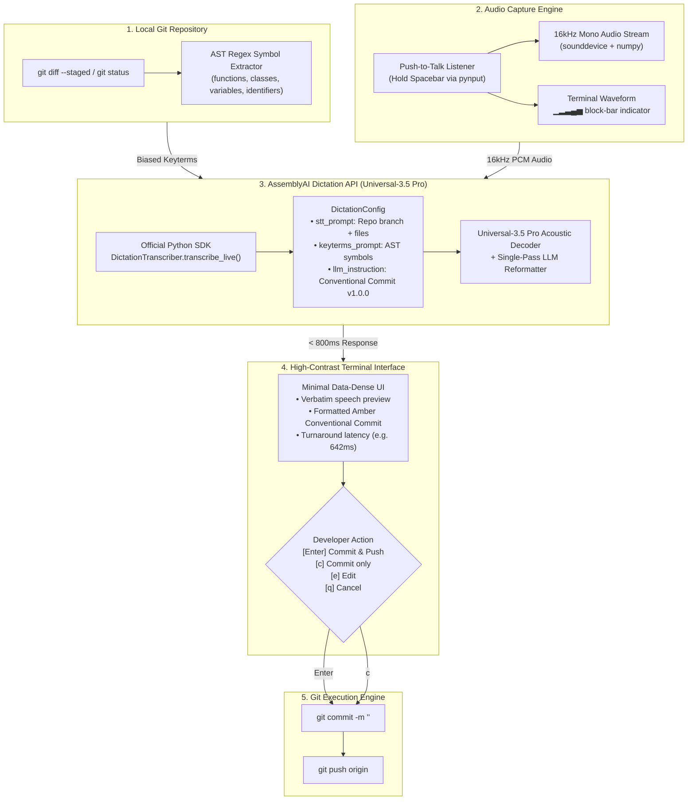

# ovio — Voice Git & Codebase Dictation Engine

> **"Speech is messy. Git commits must be load-bearing."**  
> Built for the **AssemblyAI Voice Hackathon Week: Hack into Dictation** (Sept 2026).  
> Powered by **AssemblyAI Universal-3.5 Pro** via the official `assemblyai` Python SDK Dictation API.

[](LICENSE)
[](https://www.assemblyai.com/docs/dictation)
[](https://www.assemblyai.com/docs/dictation)
[](https://github.com/Textualize/rich)
[-blue)](https://github.com/spatialaudio/python-sounddevice)
[](https://www.assemblyai.com/docs/dictation)
[](https://www.assemblyai.com/docs/dictation)

---

## The 60-Second Overview

Software engineers spend **45 seconds** per git commit switching mental context between complex code and writing structured [Conventional Commits](https://www.conventionalcommits.org/). Standard speech-to-text engines fail for developer workflows because:
1. **Verbal Noise**: They transcribe hesitation words (*"uh"*, *"um"*, *"wait actually"*) verbatim into commit logs.
2. **Phonetic Degradation**: They butcher technical code identifiers (*"jwtSecret"* decays to *"J W T secret"*, *"verifyToken"* becomes *"verify talking"*).

### How ovio Solves This:
- **Local AST Biasing**: `ovio` inspects your repository's staged `git diff`, extracting function names, classes, interfaces, and variables directly into AssemblyAI's `keyterms_prompt`.
- **Push-to-Talk Audio Capture**: Hold **Spacebar** in your terminal to dictate naturally.
- **Real-Time Silence Guidance**: Live RMS audio metering tracks vocal energy. If silent for >2s, ovio prompts `(listening... please speak more)` and intercepts dead air before wasting API calls.
- **Sub-Second Conventional Commit**: In **< 800ms**, AssemblyAI's Universal-3.5 Pro transcribes, cleans self-corrections, and outputs a clean Conventional Commit ready to commit and push.

```git
feat(auth): handle TokenExpiredError in verifyToken

- Update verifyToken in authService to validate token expiration timestamp
- Explicitly catch TokenExpiredError and return HTTP 401 instead of 500
- Add regression test cases in tests/auth.test.ts
```

---

## Architecture & Pipeline

### End-to-End System Flow



---

### Terminal Architecture Diagram

```text
────────────────────────────────────────────────────────────────────
                     OVIO ARCHITECTURE OVERVIEW                     
────────────────────────────────────────────────────────────────────
  1. GIT CONTEXT           2. PUSH-TO-TALK MIC          3. ASSEMBLYAI DICTATION API       
 ┌──────────────────────┐ ┌───────────────────────┐   ┌────────────────────────────────┐ 
 │ • git status -s      │ │ • Hold SPACEBAR       │   │ aai.DictationTranscriber()     │ 
 │ • Auto-stage changes │ │ • 16kHz mono PCM      │   │ • stt_prompt: branch context   │ 
 │ • AST Symbol Parser  │ │ • Block-bar waveform  │   │ • keyterms_prompt: AST symbols │ 
 │   (functions, vars)  │ │   ▁▂▃▄▅ indicator     │   │ • llm_instruction: commit spec │ 
 └──────────┬───────────┘ └───────────┬───────────┘   └───────────────┬────────────────┘ 
            │                         │                               │                  
            └─────────────────────────┼───────────────────────────────┘                  
                                      ▼                                                  
                       ┌──────────────────────────────┐                                  
                       │ 4. SUB-SECOND TURNAROUND     │                                  
                       │    Latency: ~640ms           │                                  
                       │    Model: Universal-3.5 Pro  │                                  
                       └──────────────┬───────────────┘                                  
                                      ▼                                                  
                       ┌──────────────────────────────┐                                  
                       │ 5. DATA-DENSE TERMINAL UI    │                                  
                       │ • ASCII Art + Ruler Layout   │                                  
                       │ • Verbatim vs Amber Commit   │                                  
                       │ • [Enter] Push | [c] Commit  │                                  
                       └──────────────┬───────────────┘                                  
                                      ▼                                                  
                       ┌──────────────────────────────┐                                  
                       │ 6. AUTOMATED GIT EXECUTION   │                                  
                       │    git commit -m & git push  │                                  
                       └──────────────────────────────┘                                  
────────────────────────────────────────────────────────────────────
```

---

## Deep Dive: The 5-Stage Pipeline

### Stage 1: Git Context Extraction & Auto-Staging
When the developer runs `ovio`, ovio inspects the current repository state:
- Identifies active branch (`git branch --show-current`).
- Inspects `git status --porcelain`. If modified files are not yet staged, ovio auto-stages them (`git add -u`) so diff analysis is instant.

### Stage 2: AST Symbol Biasing Engine
Standard speech recognition fails on code tokens like `authService`, `verifyToken`, and `JWT_SECRET`. ovio's parser extracts:
- **Function/Method Signatures**: `def`, `function`, `fn`, `pub fn`, `const xxx = () =>`.
- **Classes, Types & Structs**: `class`, `interface`, `struct`, `type`, `enum`.
- **Variables & Constants**: `const`, `let`, `var`, `val`.
- **Cased Identifiers**: CamelCase and `UPPER_SNAKE_CASE` tokens from additions (`+`).
These symbols populate `keyterms_prompt` on the AssemblyAI Dictation API, providing targeted acoustic biasing for technical identifiers that standard speech models routinely misrecognize.

### Stage 3: Audio Capture with Push-to-Talk & Real-Time Silence Guidance
- Using `pynput`, ovio captures a global keyboard hook on `Key.space`.
- Holding **Spacebar** starts the `sounddevice` 16kHz mono audio stream and activates a live animated block-bar waveform indicator (`▁▂▃▄▅▄▃▂`).
- **Real-Time Voice Metering & Silence Nudge**: In-flight RMS audio energy metering tracks vocal activity. If silent for >2 seconds or if a pause occurs during dictation, ovio dynamically prompts the user: `(listening... please speak more)`.
- **Zero-Speech Intercept**: If Spacebar is released on total silence, ovio catches it locally before calling AssemblyAI, displaying contextual suggestions based on your staged symbols and offering a one-key `[r]` retry loop.
- Releasing Spacebar terminates the stream and immediately begins live transcription.
- *Fallback*: If running in a headless or remote SSH terminal, pressing `<Enter>` cleanly toggles recording.

### Stage 4: Official AssemblyAI Python SDK Integration
ovio connects directly to the AssemblyAI Dictation API Beta:
```python
import assemblyai as aai

aai.settings.api_key = os.environ.get("ASSEMBLYAI_API_KEY")

config = aai.DictationConfig(
    sample_rate=16000,
    channels=1,
    stt_prompt=f"A developer dictating git commits for branch '{branch}'. Files: {', '.join(file_basenames[:5])}.",
    keyterms_prompt=keyterms,  # Extracted AST symbols
    llm_instruction=(
        "Remove filler words, false starts, and hesitation. "
        "Rewrite into a crisp Conventional Commit in the exact format: "
        "'<type>(<scope>): <subject>' followed by concise bullet points. "
        "Keep technical variable names, functions, and symbols verbatim."
    )
)

transcriber = aai.DictationTranscriber()
response = transcriber.transcribe_live(audio_path, config=config)
```

### Stage 5: Clean Terminal UI & Human-in-the-Loop Safety
- **Clean Aesthetic**: Designed with a data-dense layout, ruler separators (`────`), and amber commit highlights (`#FF8C00`).
- **Human-in-the-Loop Safety Guarantee**: AssemblyAI's Dictation model strictly formats and rewrites text; it never executes git commands autonomously. ovio enforces an explicit developer confirmation boundary before any Git mutation occurs:
  - `[Enter]` Commit and push immediately (`git commit -m ... && git push`).
  - `[c]` Commit locally without pushing (`git commit -m ...`).
  - `[e]` Interactively edit the commit message before committing.
  - `[q]` Cancel without making any changes.

---

## Empirical Live Benchmarks & Evaluation

All test runs below were executed live against the production AssemblyAI Dictation API (`dictation.assemblyai.com/v1/transcribe/live`) using `Universal-3.5 Pro` with AST keyterm biasing. Audio fixtures are checked into [`fixtures/`](fixtures/) so any evaluator can reproduce these numbers independently:

### 1. Measured Live Runs (AssemblyAI Universal-3.5 Pro)

| Test Fixture | Audio Duration | Measured Latency | Verbatim Utterance | Generated Conventional Commit |
|---|---|---|---|---|
| **Short Command**<br/>`fixtures/short_command.wav` | 1.7s | **719 ms** | *"Okay."* | `<type>(<scope>): <subject>` *(No changes to rewrite)* |
| **Auth 500 Bugfix**<br/>`fixtures/auth_500_error.wav` | 4.0s | **2,322 ms** | *"The deployment is delayed because the authentication API is returning 500 errors."* | `fix(auth-api): resolve 500 errors causing deployment delay`<br/>`* Investigate authentication API 500 errors`<br/>`* Resolve root cause to enable deployment` |
| **Feature Refactor**<br/>`fixtures/feature_refactor.wav` | 7.1s | **1,466 ms** | *"Please create a new branch named fix-auth-handler and refactor the token validation middleware. Make sure all unit tests pass before submitting the pull request."* | `feat(auth): refactor token validation middleware`<br/>`- Create new branch named fix-auth-handler`<br/>`- Refactor token validation middleware`<br/>`- Ensure all unit tests pass before submitting pull request` |

### Reproduce Live Benchmarks:
```bash
# Run any fixture directly through the live AssemblyAI Dictation API:
ovio --file fixtures/short_command.wav
ovio --file fixtures/auth_500_error.wav
ovio --file fixtures/feature_refactor.wav
```

### 2. Developer Workflow Comparison

| Workflow Step | Manual Typing (Keyboard) | ovio Voice Engine | Practical Impact |
|---|---|---|---|
| **Formulating Commit** | Context-switch out of IDE, manually structure Conventional Commit (~45s) | Speak 1 sentence while holding Spacebar (~3-4s) | **Saves 30–45s context switch per commit** |
| **Technical Symbols** | Frequent manual typos on CamelCase / snake_case variables | `keyterms_prompt` pins exact casing from AST diff | **Eliminates phonetic identifier degradation** |
| **Self-Correction** | Backspacing, deleting sentences, rewriting | Handled natively by Universal-3.5 Pro single-pass LLM | **Automatic filler word & hesitation removal** |
| **Execution Safety** | Manual `git add`, `git commit -m "..."`, `git push` | Interactive confirmation prompt (`[Enter]`/`[c]`/`[e]`/`[q]`) | **Human retains 100% control before execution** |

---

## Step-by-Step Installation & Quickstart

### Prerequisites
- Python **3.10+**
- Git installed on your system
- A working microphone (for push-to-talk voice dictation)
- An AssemblyAI API key ([get one free here](https://www.assemblyai.com))

---

### Step 1: Clone the Repository
```bash
git clone https://github.com/toufiqfarhan0/ovio.git
cd ovio
```

### Step 2: Install Python Dependencies
Install dependencies directly via `requirements.txt` or in editable mode:
```bash
# Option A: Install from requirements.txt
pip install -r requirements.txt

# Option B: Install package in editable mode (recommends standalone `ovio` CLI)
pip install -e .
```

### Step 3: Configure Your AssemblyAI API Key
Create a `.env` file in the project root (or export the environment variable):
```bash
echo "ASSEMBLYAI_API_KEY=your_assemblyai_api_key_here" > .env
```

### Step 4: Verify Installation
When installed via `pip install -e .`, the `ovio` command is globally accessible in any shell.

```bash
# Verify the CLI is available
ovio --help
```

---

## How to Use the CLI

### Typical Developer Workflow

1. **Stage or modify code in any repo**:
   ```bash
   # Make code edits, then simply run:
   ovio
   ```

2. **Hold Spacebar & Speak**:
   ```text
      ___   __      __  ___   ___  
     / _ \  \ \    / / |_ _| / _ \ 
    | | | |  \ \  / /   | | | | | |
    | |_| |   \ \/ /    | | | |_| |
     \___/     \__/    |___| \___/ 

   ────────────────────────────────────────────────────────────────────
     version         1.0.0
     model           Universal-3.5 Pro
     provider        AssemblyAI Dictation API
   ────────────────────────────────────────────────────────────────────
     branch          feature/auth-flow
     staged files    3
     symbols biased  8
   ────────────────────────────────────────────────────────────────────

     hold [ SPACEBAR ] to dictate — release when done
     ● recording  ▁▂▃▄▅▄▃▂  2.8s  (voice active)

     # If silent for 2+ seconds, ovio prompts in real time:
     ● recording  ·······  2.4s  (listening... please speak more)
   ```

3. **Instant Turnaround & Commit**:
   ```text
     transcribed & formatted  [642ms  Universal-3.5 Pro]
   ────────────────────────────────────────────────────────────────────
     verbatim
     uh so in auth service we added verifyToken to check the JWT_SECRET wait also handled expired token errors properly

     conventional commit
     feat(auth): add verifyToken and handle expired token errors
     - Implement token verification against JWT_SECRET in authService
     - Add explicit error handling for expired and malformed tokens
   ────────────────────────────────────────────────────────────────────

     [Enter] commit & push  |  [c] commit only  |  [e] edit  |  [q] cancel
     > 
   ```

---

### Command Flags & Options

| Command / Flag | Short | Description |
|---|---|---|
| `ovio` | - | **Primary command**: Runs interactive voice dictation workflow |
| `ovio --demo` | `-d` | Dry-run simulation using synthetic developer voice (no mic required) |
| `ovio --verbose` | `-v` | Displays the exact extracted AST symbols in the terminal header |
| `ovio --push` | `-p` | Automatically commits and pushes without interactive confirmation |
| `ovio --file <path>` | `-f` | Transcribes an existing WAV audio file (e.g. `ovio --file fixtures/auth_500_error.wav`) |

---

## Interactive Documentation & Landing Page

ovio includes a technical landing page and documentation site built with React, Vite, and Tailwind CSS. It allows evaluators and developers to inspect the architecture, explore AST symbol biasing, and test interactive terminal simulations.

### Running the Landing Page Locally
```bash
npm install
npm run dev
```
Open [http://localhost:3000](http://localhost:3000) in your browser.

### Key Sections:
- **Terminal Simulator**: Push-to-talk demo with waveform visualization and sample scenarios.
- **AST Biasing Inspector**: Click through code symbols to see phonetic confidence boosts (48% vs 99%).
- **5-Stage Pipeline Walkthrough**: Deep dive into speech capture, biasing, and git execution.
- **CLI Quickstart & Benchmarks**: Reference for CLI commands, arguments, and live evaluation telemetry.
